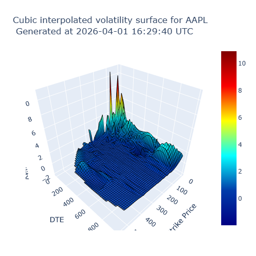

# 📈 Implied Volatility Surface Project

## 📌 Overview

Built an **implied volatility surface** from real options market data using the Black-Scholes framework.
Implemented **robust numerical methods (Brent method)** to solve for implied volatility and constructed a smooth 3D surface via interpolation.

This project integrates:

* Quantitative finance theory (risk-neutral pricing)
* Numerical root-finding algorithms
* Data cleaning and filtering techniques
* 3D visualization of volatility surfaces

---

## 🔥 Key Features

* 📊 **Implied Volatility Computation**
  Robust numerical methods (Brent method)

* 🧮 **Quantitative Modeling**
  Black-Scholes model under risk-neutral measure

* 🧹 **Data Cleaning & Filtering**
  Handles noisy and incomplete market data

* 📈 **3D Visualization**
  Interactive implied volatility surface using Plotly

* ⚖️ **No-Arbitrage Awareness**
  Financially consistent volatility surface construction

---

## 📸 Example Output

<p align="center">
  
</p>

---

## 📂 Project Structure

```text
implied_volatility_project/

├─ bs_brent_method.py      # Brent method for IV solving
├─ config.py               # Configuration
├─ data.py                 # Data fetching
├─ filter_options.py       # Data cleaning & filtering
├─ plotter.py              # Visualization (3D surface)
├─ main.py                 # Entry point
├─ requirements.txt
├─ LICENSE
├─ newplot.png
└─ README.md
```

---

## ⚙️ Methodology

### 🔹 Black-Scholes Framework

Implied volatility is obtained by solving:

$\text{BS}(\sigma) = \text{Market Option Price}$

Under the **risk-neutral measure**, the drift term $\mu$ does not appear in the pricing formula.

There exists a **unique implied volatility $\sigma$** that matches market prices, since option prices are:

* Continuous in volatility
* Monotonically increasing

---

### 🔹 Implied Volatility Computation

#### Brent Method (Primary)

* Combines:

  * Bisection
  * Secant
  * Inverse quadratic interpolation
* No derivative required
* Guaranteed convergence
* Highly stable

#### Alternative Methods

* Newton-Raphson
* Bisection
* Hybrid methods

#### Newton Method Limitations

* Sensitive to initial values

* May fail when $d_1$ is large or Vega is very small: when $d_1$ is large, $\Phi(d_1)$ approaches 1, so the option price becomes insensitive to $\sigma$ (the derivative of the BS formula with respect to $\sigma$ tends to 0), making numerical solving difficult and potentially unstable.

* Function shape:

  * Concave (small ( $\sigma$ ))
  * Convex (large ( $\sigma$ ))

→ Leads to:

* Oscillation
* Overshooting
* Divergence

---

## 📊 Data Processing

### Cleaning & Filtering

* Remove invalid implied volatility values
* Exclude zero time-to-expiry options

### Practical Constraints

Due to API limitations:

* We use the **daily close price** of the option as a proxy for the average of the latest bid and ask, since the actual last-trade data is not available.  
* If bid-ask data **is available**, we can further filter the data by:  
  - $\text{spread} = \text{ask} -\text{bid} \in [\mu - 2.5\sigma, \mu + 2.5\sigma]$  
  - days_since_trade < 5

---

## 📈 Volatility Surface Construction

### Current Implementation

* **Cubic interpolation**

### Possible Extensions

* SVI (Stochastic Volatility Inspired)
* Bachelier model
* Kriging
* Gaussian Mixture Models
* Variational Autoencoders (VAE)

---

## ⚖️ No-Arbitrage Considerations

In efficient markets:

* Arbitrage opportunities are quickly exploited
* Prices adjust rapidly

Therefore:

👉 A valid volatility surface should be **arbitrage-free**

### Why it matters

* Prevents pricing inconsistencies
* Critical for:

  * Market makers
  * Risk management
  * Derivatives pricing

---

## 🚀 How to Run

### 1. Install dependencies

```bash
pip install -r requirements.txt
```

### 2. Set API key

Create `.env`:

```bash
MASSIVE_API_KEY="your_api_key_here"
```

### 3. Run

```bash
python main.py
```

---

## 📊 Output

* 3D implied volatility surface
* Smooth interpolated structure
* Plotly interactive visualization

---

## 🔑 Key Insights

* Implied volatility is **not directly observable**
* Must be solved numerically
* Numerical stability is critical
* Data quality strongly affects results

---

## 📌 Future Improvements

* SVI calibration for arbitrage-free surface
* Explicit arbitrage constraints
* Improved liquidity filtering
* Use real bid-ask spreads
* Model calibration to market data

---

## 📎 Project Context

This project was developed independently as part of my quantitative finance learning, focusing on practical implementation of derivatives pricing and volatility modeling.

---

## 👤 Author

**Yang Pei**

PhD in Mathematics, Sorbonne University

📧 [peiyang0918@gmail.com](mailto:peiyang0918@gmail.com)

---

This project demonstrates practical implementation of **quantitative finance concepts**, including option pricing, numerical methods, and volatility modeling.
